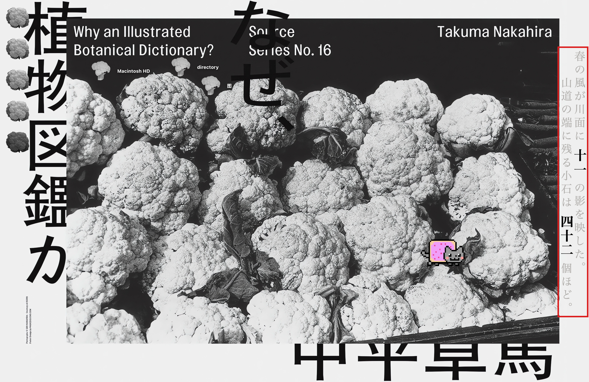
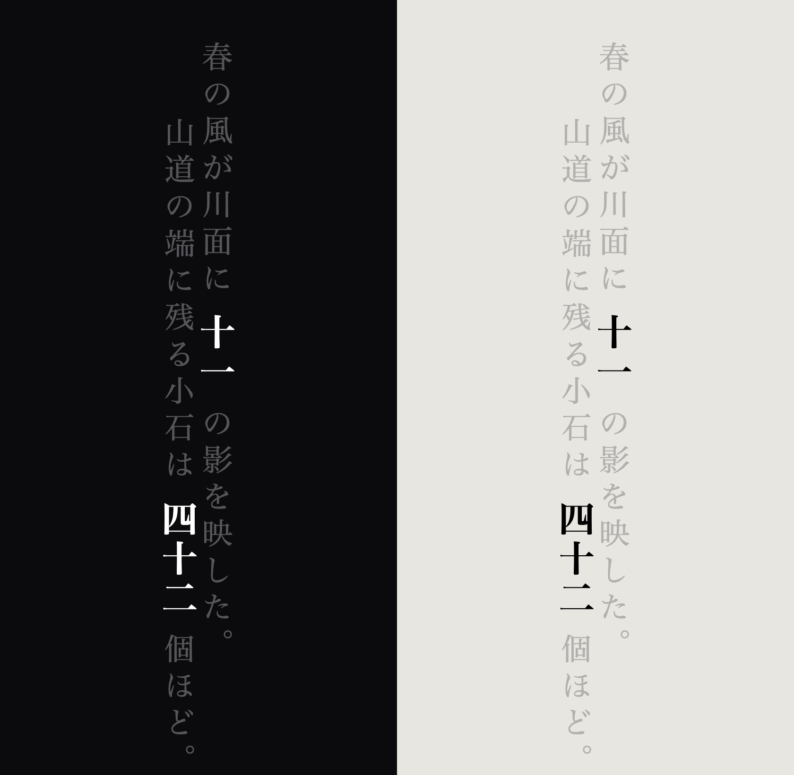

# found-time

A Japanese [llamppl](https://github.com/genlm/llamppl) clock. Display
implemented with [Rücksicht](https://github.com/shepardxia/ruecksicht).

Seed corpus ([Aozora Bunko](https://www.aozora.gr.jp), `corpus/build.py`):
- 梶井基次郎
- 宮沢賢治
- 夏目漱石
- 芥川竜之介
- 太宰治
- 中島敦



<p align="center"></p>

<p align="center">11:42 — <i>A spring wind laid eleven shadows on the river. / Some forty-two pebbles
remain at the edge of the mountain path.</i></p>

## Install

```sh
brew tap shepardxia/ruecksicht https://github.com/shepardxia/ruecksicht
brew install ruecksicht
brew services start ruecksicht
rk add https://github.com/shepardxia/found-time
```

Needs `llamppl` with the `mlx` extra on the Python that `tick.sh` names; the
model, `LiquidAI/LFM2.5-1.2B-JP-202606-MLX-4bit`, downloads on the first
minute.

## Files

`gen.py` writes one minute. `clockd.py` keeps the model loaded and writes this
minute and the next to `clock.json`; below 25% battery it serves a minute it
has seen before from `store.jsonl`. `tick.sh` keeps `clockd` running.
`index.jsx` draws it.
